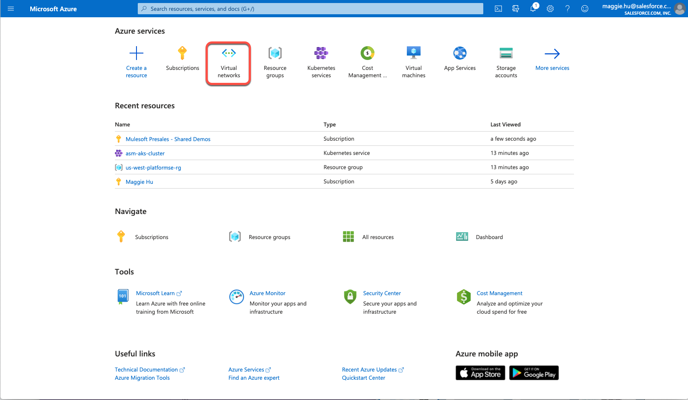

# ASMonAzure
Walk through on how to install Anypoint Service Mesh on Azure Kubernetes Servies
  
Update: April 30, 2020

## Introduction

This cookbook will walk you through the process of installing **Anypoint Service Mesh** on **Azure**. You will deploy a demo application and secure using Anypoint Service Mesh.

***To log issues***, click here to go to the [github](https://github.com/mulesoft-consulting/ASMonAzure/issues) repository issue submission form.

## Objectives

- [Create Kubernetes Cluster on Azure Kubernetes Services (AKS)](#installaks)
- [Install Istio](#installistio)
- [Deploy Demo Application](#deploydemo)
- [Install Anypoint Service Mesh](#installasm)
- [Apply API Management Policies](#applypolicy)

## Required Artifacts

- The following lab requires an Enterprise Azure account.
- Enable Anypoint Service Mesh in your STGX Organization (this is required before GA)

<a id="installaks"></a>
## Create Azure Kubernetes Services Cluster

### **STEP 1**: Create Azure Virtual Network

- From any browser, go to the URL to access Azure Portal:

   <https://portal.azure.com/>

- Under Azure services, select **Virtual networks**.

    

- Click on **Add** at the left top corner or **Create virtual network**.

	

- Select **Resource Group** Enter **Name** for instance and select **Region** for Virtual Network creation.

    

- Select and remove the **default** subnet. Add a new subnet with more available IP addresses.

	


- The lower the subnet number is like /16, the more IP addresses are available.

	

- Click **Next** to **Review + create**. Ensure the validation passed & click on **Create**.

    
    
- Wait till the deployment is complete.

	

### **STEP 2**: Create Kubernetes Cluster

- Back to the Azure Portal home page. Select **Kubernetes services**

    

- Click **Create cluster**. Select **Resource group**, enter a unique **Kubernetes cluster name**, select Region, and click on Change size for **Node size**.
	
    

- Select **B4ms**, per [documentation](https://beta.docs.stgx.mulesoft.com/beta-service-mesh/service-mesh/1.0/prepare-to-install-service-mesh#hardware-requirements)

    

- Keep everything default till the **Networking** step. Switch **Network configuration** from **Basic** to **Advanced**. Select the **Virtual network** created in **STEP 1**. Enter **Kubernetes service address range** and **Kubernetes DNS service IP address** allowed in the selected **Virtual network**.

    
    
- At the **Tags** step at some tags that help identify the resources you're creating, like **owner** -> **Email**. 

	
	
- Move on to the last step, **Review + create**. Ensure the validation passed & click on **Create**.

		
	
- Wait till the deployment is complete.

	

### **STEP 3**: Verify Cluster and Connect

- From the Kubernetes Services page, launch the **az** command line from the newly created AKS clluster using either *Bash* or *Powershell*. Make sure your account's initialized successfully from the Cloud Shell. 

		

- Open Terminal window. If you don't already have the **Azure CLI** installed following the [Install Azure CLI](https://docs.microsoft.com/en-us/cli/azure/install-azure-cli?view=azure-cli-latest) to first install Azure CLI.

- Next running the following command to verify that you cluster is running.

```bash
kubectl get namespaces
```


<a id="installistio"></a>
## Install Istio

### **STEP 4**: Download and Install Istio CLI

- To install **Istio** we will be using the **Istio CLI**. For completed instructions [Istio Docs](https://istio.io/docs/setup/install/istioctl/)

