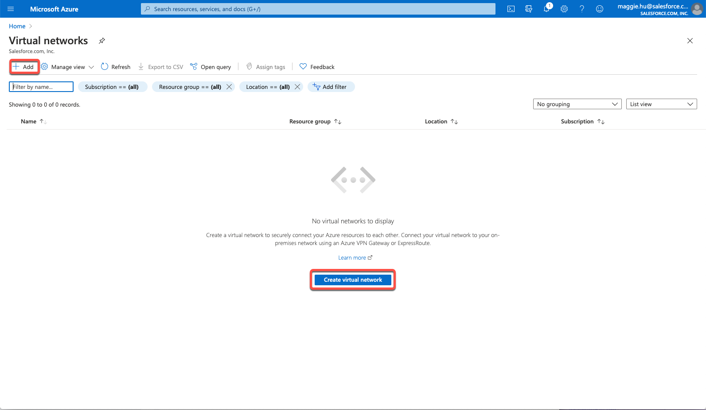
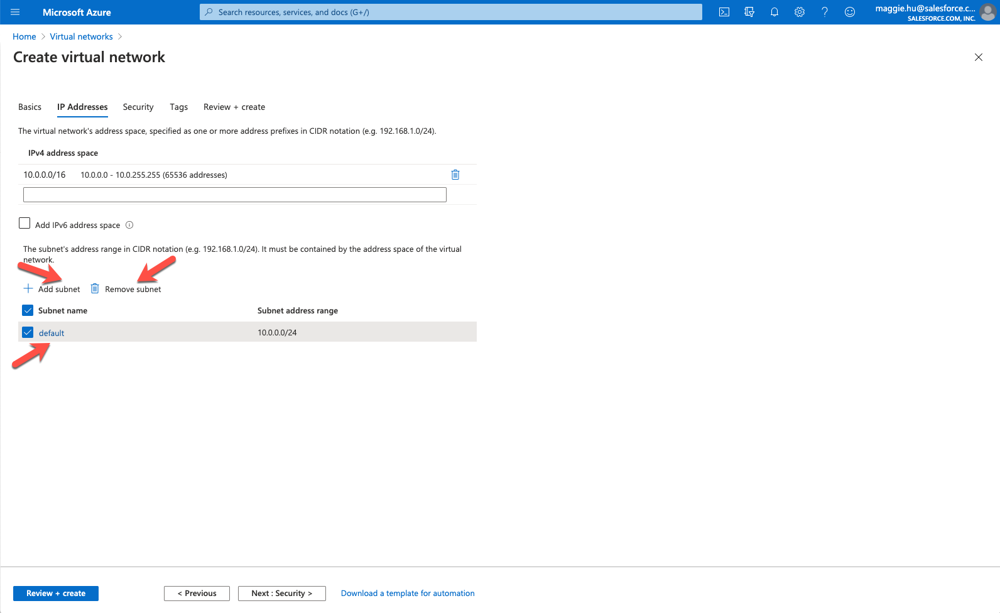
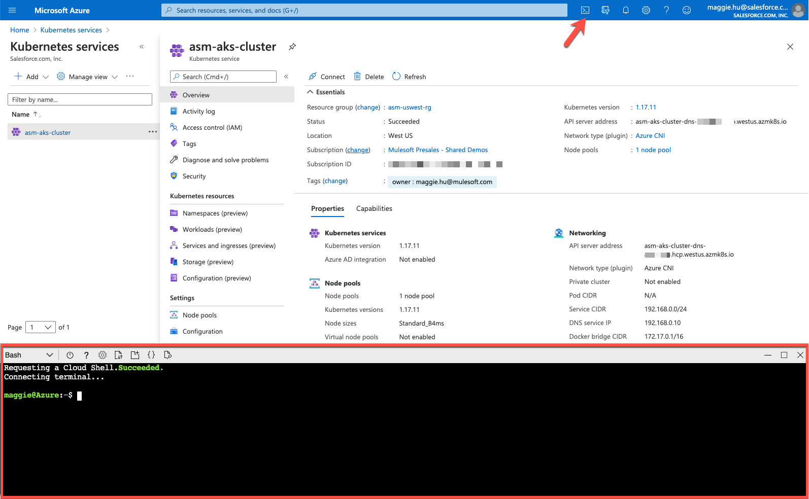
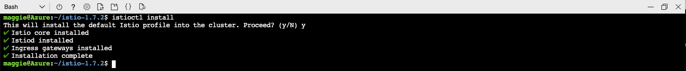
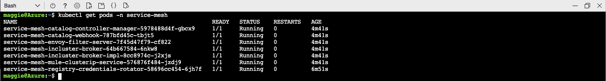
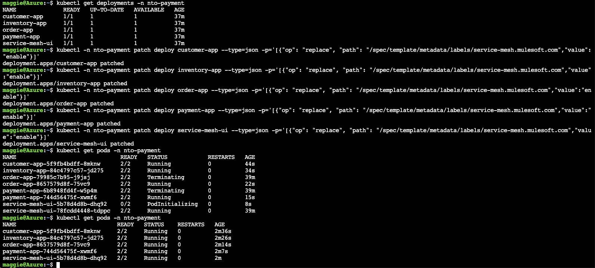
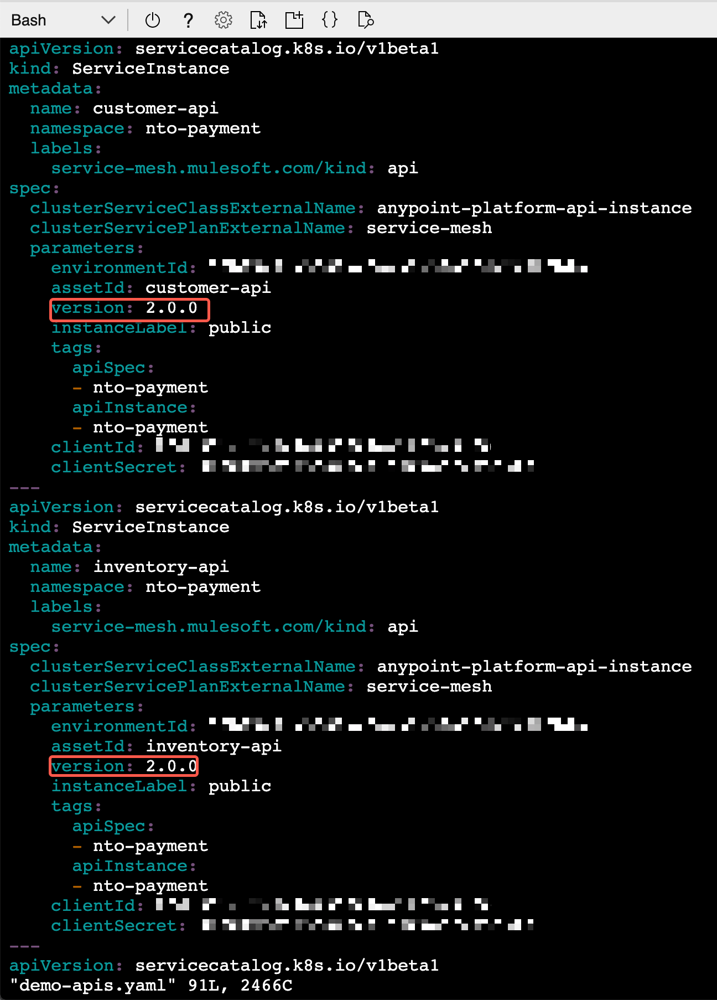
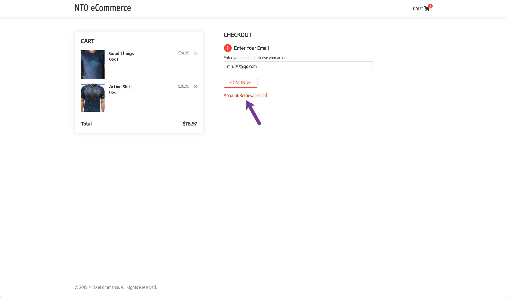
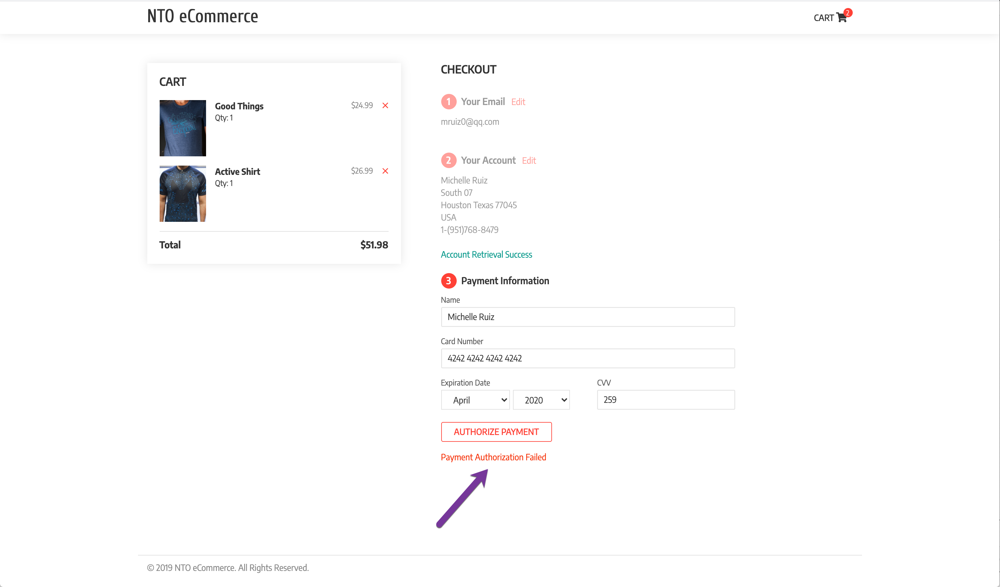
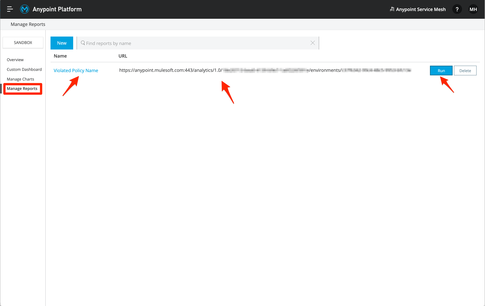

# ASMonAzure


## Introduction

This cookbook will walk you through the process of installing **Anypoint Service Mesh** on **Microsoft Azure Cloud Platform**. You will deploy a demo application and secure using Anypoint Service Mesh.

***To log issues***, click here to go to the [github](https://github.com/mulesoft-consulting/ASMonAzure/issues) repository issue submission form.

## Objectives

- **[Create Kubernetes Cluster on Azure Kubernetes Services (AKS)](#installaks)**
	- [**STEP 1:** Create Azure Virtual Network](#step1)
	- [**STEP 2:** Create Kubernetes Cluster](#step2)
	- [**STEP 3:** Verify Cluster and Connect](#step3)

- **[Install Istio](#installistio)**
	- [**STEP 4:** Download and Install Istio CLI](#step4)
	- [**STEP 5:** Install Istio Using CLI](#step5)
- **[Deploy Demo Application](#deploydemo)**
	- [**STEP 6:** Clone Demo Application](#step6)
	- [**STEP 7:** Deploy Demo Application](#step7)
- **[Install Anypoint Service Mesh](#installasm)**
	- [**STEP 8:** Install Anypoint Service Mesh](#step8)
	- [**STEP 9:** Install Anypoint Service Mesh Adapter](#step9)
	- [**STEP 10:** Create APIs](#step10)
	- [**STEP 11:** Binding APIs with Services](#step11)
- **[Apply API Management Policies](#applypolicy)**
	- [**STEP 12:** Apply Rate Limiting Policy to Customer API](#step12)
	- [**STEP 13:** Apply Client ID enforcement Policy to Payment API](#step13)
- **[Report & Monitor API Analytics](#reportmonitoranalytics)**
	- [**STEP 14:** View Analytics of Customer API & Payment API](#step14)
	- [**STEP 15:** View Dashboards of Customer API & Payment API](#step15)
- **[Cleanup (Optional)](#cleanup)**
	- [**STEP 16:** Cleanup APIs & Bindings](#step16)

## Required Artifacts

- The following lab requires an Enterprise Azure account.
- Enable Anypoint Service Mesh in your Anypoint Platform Organization.

For complete instructions please visit [MuleSoft Documentation](https://docs.mulesoft.com/service-mesh/1.1/)

<a id="installaks"></a>
## Create Azure Kubernetes Services Cluster

<a id="step1"></a>
### **STEP 1**: Create Azure Virtual Network

- From any browser, go to the URL to access Azure Portal:

   <https://portal.azure.com/>

- Under Azure services, select **Virtual networks**.

    

- Click on **+ Add** at the left top corner or **Create virtual network** if there isn't any already.

	

- Create a new **Resource Group**.
    

- Select **Resource Group**. Enter a unique **Name** for instance and select **Region** for Virtual Network creation.
    

- Select and remove the **default** subnet. Add a new subnet with more available IP addresses.

	


- The lower the subnet number is like /16, the more IP addresses are available.

	

- Click **Next** to **Review + create**. Ensure the validation passed & click on **Create**.

    
    
- Wait till the deployment is complete.

	

<a id="step2"></a>
### **STEP 2**: Create Kubernetes Cluster

- Back to the Azure Portal home page. Select **Kubernetes services**

    

- Click on **+ Add** at the left top corner of **Kubernetes services**, or **Create Kubernetes service** if there isn't any already. Select **Resource group**, enter a unique **Kubernetes cluster name**, select Region, and click on Change size for **Node size**.
	
    

- Select **B4ms**, per [documentation](https://docs.mulesoft.com/service-mesh/1.0/prepare-to-install-service-mesh)

    

- Keep everything default till the **Networking** step. Switch **Network configuration** from **Basic** to **Advanced**. Select the **Virtual network** created in **STEP 1**. Enter **Kubernetes service address range** and **Kubernetes DNS service IP address** allowed in the selected **Virtual network**.

    
    
- At the **Tags** step at some tags that help identify the resources you're creating, like **owner** -> **Email**. 

	
	
- Move on to the last step, **Review + create**. Ensure the validation passed & click on **Create**.

		
	
- Wait till the deployment is complete.

	

<a id="step3"></a>
### **STEP 3**: Verify Cluster and Connect

- From the Kubernetes Services page, launch the **az** command line from the newly created AKS cluster using either *Bash* or *Powershell*. Make sure your account's initialized successfully from the Cloud Shell. 

		

- Open Terminal window. If you don't already have the **Azure CLI** installed following the [Install Azure CLI](https://docs.microsoft.com/en-us/cli/azure/install-azure-cli?view=azure-cli-latest) to first install Azure CLI.

- Next running the following command to verify that you cluster is running.

```bash
az account set --subscription 5fe30022-9d07-462a-9eba-41cd46f0981c
az aks get-credentials --name asm-aks-cluster --resource-group asm-uswest-rg
kubectl get namespaces
```


<a id="installistio"></a>
## Install Istio

<a id="step4"></a>
### **STEP 4**: Download and Install Istio CLI

- To install **Istio** we will be using the **Istio CLI**. For completed instructions [Istio Docs](https://istio.io/docs/setup/install/istioctl/)

- Use the following command to download **Istio CLI** into your directory of choice and supported by Anypoint Service Mesh (1.6.x or 1.7.x at this time).

```bash
curl -L https://istio.io/downloadIstio | ISTIO_VERSION=<x.x.x> sh -
```


- Change into newly downloaded directory (the Istio version downloaded and to be installed)

```bash
cd istio-<x.x.x>/
```

- Add current directory directly to path

```bash
export PATH=$PWD/bin:$PATH
```


<a id="step5"></a>
### **STEP 5**: Install Istio using CLI

- To install Istio we will be using the Istio CLI. From the istio directory run the following command. At the prompt Proceed? (y/N) enter y

```bash
istioctl install
```



- Verify that **Istio** has been installed. You should now see the **istio-system** namespace

```bash
kubectl get namespaces
```


<a id="deploydemo"></a>
## Deploy Demo Application

<a id="step6"></a>
### **STEP 6**: Clone Demo Application

- For our demo application will will be using **Northern Trail Outfitters** shopping cart application. This web based UI will call several services to complete the order.

- Clone the demo application git repository onto your local machine.

```bash
git clone https://github.com/mulesoft-consulting/ServiceMeshDemo -b 1PlatformDemo
```

- Change to the **ServiceMeshDemo** directory and list out the contents to verify that the repository has been created correctly

```bash
cd ServiceMeshDemo/
ls
```


<a id="step7"></a>
### **STEP 7**: Deploy Demo Application

- We will now deploy the demo application to your kubernetes cluster. The deployment script takes the namespace as a parameter. We will be using **nto-payment** for namespace

```bash
./deployAll.sh nto-payment
```


- You can monitor the deployment with the following commands

```bash
kubectl get pods -n nto-payment
kubectl get services -n nto-payment
```


- Once all services are running you can test out the application. To access the application open you browser and go to the following URL

```bash
http://<EXTERNAL-IP>:3000
```


- To test out the application follow these steps:

    - Select Item to purchase
    - Click **ADD TO CART**
    - Click **CHECKOUT**
    - Leave default email and click **CONTINUE**
    - Click **AUTHORIZE PAYMENT**
    - Last click **PLACE ORDER**


<a id="installasm"></a>
## Install Anypoint Service Mesh

<a id="step8"></a>
### **STEP 8**: Install Anypoint Service Mesh

For complete instructions and documentation please visit [MuleSoft Docs](https://docs.mulesoft.com/service-mesh/latest/)

- First lets enable API Analytics by setting the **disableMixerHttpReports** flag to false:

```bash
kubectl -n istio-system get cm istio -o yaml | sed -e 's/disableMixerHttpReports: true/disableMixerHttpReports: false/g' | kubectl replace -f -
```


- Download the latest Anypoint Service Mesh CLI and make it executable

```bash
mkdir -p $HOME/.asm && curl -Ls http://anypoint.mulesoft.com/servicemesh/xapi/v1/install > $HOME/.asm/asmctl && chmod +x $HOME/.asm/asmctl && export PATH=$PATH:$HOME/.asm
```

- Now we are ready to install Anypoint Service Mesh. To do this we will call **asmctl install**. This command requires 3 parameters:
    - Client Id
    - Client Secret
    - Service Mesh license

- If you are not familiar with how to get environment Client Id and Secret, navigate to **API Manager** and click on the **Environment Information** button.


```bash
asmctl install
```


- Verify that Anypoint Service Mesh has been installed correctly with the following command

```bash
kubectl get pods -n service-mesh
```



<a id="step9"></a>
### **STEP 9**: Install Anypoint Service Mesh Adapter

- Next we want to deploy the Anypoint Service Mesh adapter in each namespace that we want to monitor APIs. For this example we will just be doing the **nto-payment** namespace that contains the demo application.

- To deploy the ASM Adapter we will be using a Kubernetes custom resource definition (CRD). In the **ServiceMeshDemo** repository we have create the file **nto-payment-asm-adapter.yaml** that can modified.

    

- Replace **```<CLIENT ID>```** and **```<CLIENT SECRET>```** with values for your environment. Save file and run the following command

```bash
kubectl apply -f nto-payment-asm-adapter.yaml
```


- Use the following command to monitor the progress. Wait for status to change to **Ready**

```bash
asmctl adapter list
```


- After you provision the adapter, you must set the `istio-injection=enabled` label on the namespace by runnning the following command

```bash
kubectl label ns nto-payment istio-injection=enabled
```

- Redeploy all the existing applications in the namepsace. See Step 6.2 in [MuleSoft Docs](https://docs.mulesoft.com/service-mesh/1.1/provision-adapter-configure-service-mesh-CLI)

```bash
kubectl get deployments -n nto-payment
```

```bash
kubectl -n nto-payment patch deploy customer-app --type=json -p='[{"op": "replace", "path": "/spec/template/metadata/labels/service-mesh.mulesoft.com","value":"enable"}]'
```

```bash
kubectl -n nto-payment patch deploy inventory-app --type=json -p='[{"op": "replace", "path": "/spec/template/metadata/labels/service-mesh.mulesoft.com","value":"enable"}]'
```

```bash
kubectl -n nto-payment patch deploy order-app --type=json -p='[{"op": "replace", "path": "/spec/template/metadata/labels/service-mesh.mulesoft.com","value":"enable"}]'
```

```bash
kubectl -n nto-payment patch deploy payment-app --type=json -p='[{"op": "replace", "path": "/spec/template/metadata/labels/service-mesh.mulesoft.com","value":"enable"}]'
```

```bash
kubectl -n nto-payment patch deploy service-mesh-ui --type=json -p='[{"op": "replace", "path": "/spec/template/metadata/labels/service-mesh.mulesoft.com","value":"enable"}]'
```

```bash
kubectl get pods -n nto-payment
```



- Verify the Envoy sidecar is injected within each pod in the Kubernetes Cluster by running the following command

```bash
asmctl management check sidecar --namespace=nto-payment
```


<a id="step10"></a>
### **STEP 10**: Create APIs

- We will now use Anypoint Service Mesh auto discovery to create API's in Anypoint Platform. We will create API's for Customer, Inventory, Order and Payments services that are used by the demo application.

- Before creating the APIs, ensure the Anypoint Platform user has **API Manager Environment Administrator** permission, in addition to **Manage APIs Configuration**. This can be done by your organization admin in **Access Management*.


 

- Modify the Kubernetes custom resource definition (CRD) file **demo-apis.yaml**. 

- For each API, replace **```<ENV ID>```**, **```<USER>```** and **```<PASSWORD>```** with the values for your environment.
- You'll need to [Configure Connected Apps](https://docs.mulesoft.com/service-mesh/1.1/obtain-connected-apps-credentials) to get the client credentials into your CRD file.

**NOTE:** If you run this multiple times you might need to change the version number in **demo-apis.yaml**, since Anypoint Platform will keep it around for 7 days.


```bash
kubectl apply -f demo-apis.yaml
```


- Use the following command to monitor the progress. Wait for status to change to **Ready**

```bash
asmctl api list
```


- You can also verify that the API's have been created in Anypoint Platform. Go to Anypoint Platform and navigate to **API Manager**

    

<a id="step11"></a>
### **STEP 11**: Binding APIs with Services

- The last step is to bind the Kubernetes Services with the Anypoint Platform API's. To do this you will use the binding definition file **demo-bind-apis.yaml**. Execute the following command

```bash
kubectl apply -f demo-bind-apis.yaml
```


- Use the following command to monitor the progress. Wait for status to change to **Ready**

```bash
asmctl api binding list
```


- If you go to **API Management** in Anypoint Platform and refresh the page you will see that the API's are now **Active**. 


- You have completed the installation of Anypoint Service Mesh. In the next section we will walk through applying some policies against the kubernetes services.

<a id="applypolicy"></a>
## Apply API Management Policies

<a id="step12"></a>
### **STEP 12**: Apply Rate Limiting Policy to Customer API

- From the **API Management** Screen in Anypoint Platform click on the version number for **customer-api**

    

- Click **Policies** and then click **Apply New Policy**. Expand **Rate Limiting** select newest version and click **Configure Policy**. 

    

- We will configure the rate limit to be 1 call per minute. Click **Apply**

    

- You should now see your new **Rate limiting** policy.

	 

- To test this out run through the order process in the demo application. Try to run through it 2 times within a minute. The second time through you will get **Account Retrieval Failed** error.

    

- Before moving onto the next step remove the **Rate Limiting** policy.

<a id="step13"></a>
### **STEP 13**: Apply Client ID enforcement Policy to Payment API

- Navigate back to the ***API Administration** page. Click on the version number for **payment-api**.

- Click **Policies** and then click **Apply New Policy**. Expand **Client ID enforcement** select newest version and click **Configure Policy**. 

    

- Leave all defaults and click **APPLY**

	 

- You should now see your new **Client ID enforcement** policy.

	 

- Once again run through the demo application but this time you should see **Payment Authorization Failed** when you click **AUTHORIZE PAYMENT**

    


<a id="reportmonitoranalytics"></a>
## Report & Monitor API Analytics

<a id="step14"></a>
### **STEP 14**: View Analytics Reports Dashboards of Customer API & Payment API

- From **API Manager**, click on **Analytics** on the left.


- At the top, select the desired date range, filter by the APIs, and check **Include Policy Violations**


- You can also build a report for API Analytics collected from service-service communication. The API Analytics provides insights into health of managed APIs - status code, policy violations, response time and such.  
Follow [MuleSoft API Analytics Documentation](https://docs.mulesoft.com/api-manager/2.x/analytics-event-api#creating-a-report) to create an API Analytics report for all APIs and review if APIs are working as expected.



- Click on **Run** of the report, you could download the report in the browser or view the report usring curl with the report URL to look at more details.


[Violated Policy Name.csv](Violated%20Policy%20Name.csv)

<a id="step15"></a>
### **STEP 15**: View Dashboards of Customer API & Payment API
- Navigate to the **Anypoint Monitoring** from either Anypoint Platform home page, or the hamburger menu at the top left corner.

- You can click on **Built-in dashboards** on the left to check out what's populated for the Customer & Payment APIs. In the drop-down, choose the **environment**, **resource name**, and the **API version / Instance**, and click on **View**. 


- At the top right corner of the dashboard, adjust the time period and turn on Auto-Refresh for **Customer API**. 


- Repeat the above and choose **Payment API** this time and check out its Analytics as well. 


**CONGRATULATIONS!!!** You have completed installing Anypoint Service Mesh, applying policies to kubernetes services, reporting and monitoring the analytics of these non-Mule services via Anypoint Platform.

<a id="cleanup"></a>
## Cleanup (Optional)

<a id="step16"></a>
### **STEP 16**: Cleanup APIs and API Bindings

- Use the following command to list the API Bindings:

```bash
asmctl api binding list
```

- Use the following commands to delete the API Bindings for the Customer, Inventory, Order, and Payment APIs in the nto-payment namespace:
```bash
asmctl api binding delete --namespace=nto-payment --name=customer-api-binding
```

```bash
asmctl api binding delete --namespace=nto-payment --name=inventory-api-binding
```

```bash
asmctl api binding delete --namespace=nto-payment --name=order-api-binding
```

```bash
asmctl api binding delete --namespace=nto-payment --name=payment-api-binding
```

- Use the following command to delete the Customer, Inventory, Order, and Payment APIs created in API Manager:

```bash
kubectl delete -f demo-apis.yaml
asmctl api list
```


- Remove any stale APIs from API Manager on Anypoint Platform.


- Remove any stale APIs from Exchange on Anypoint Platform.

